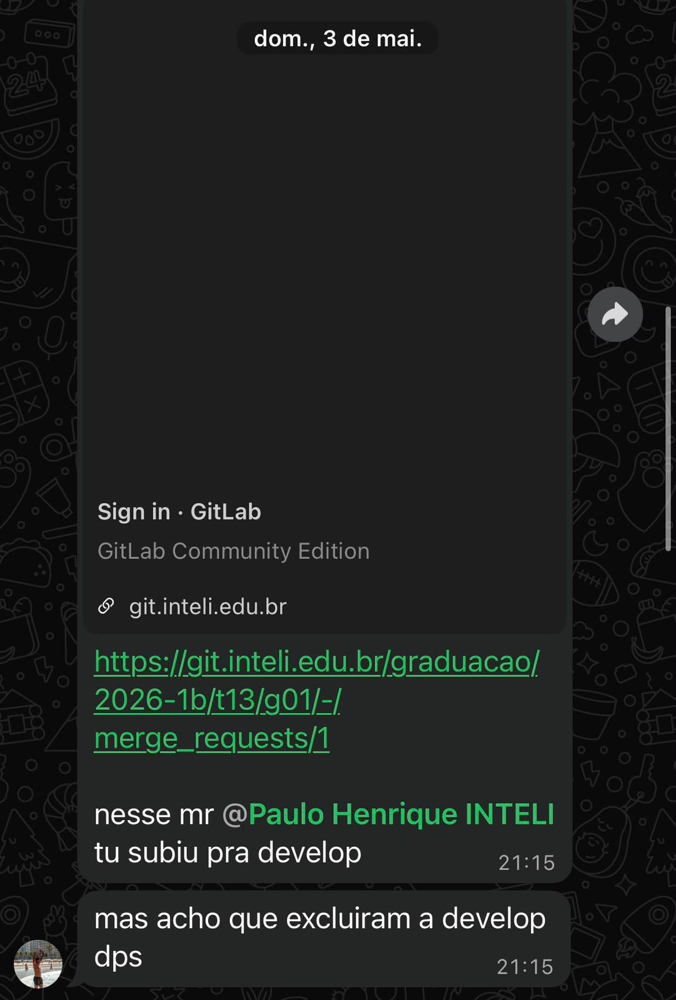
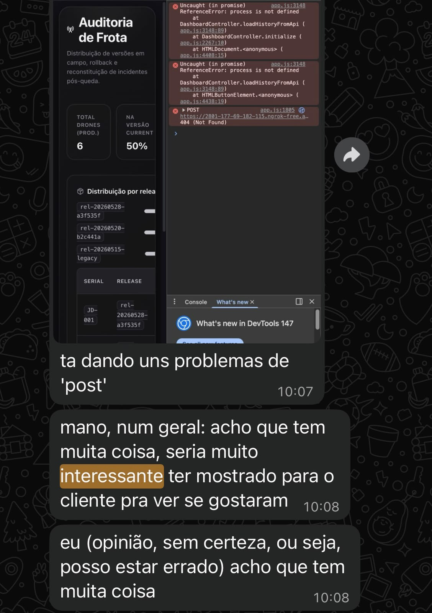
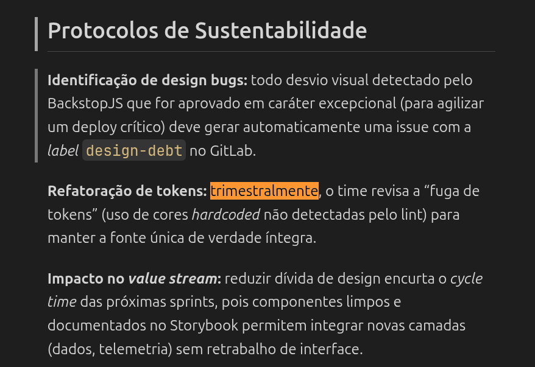
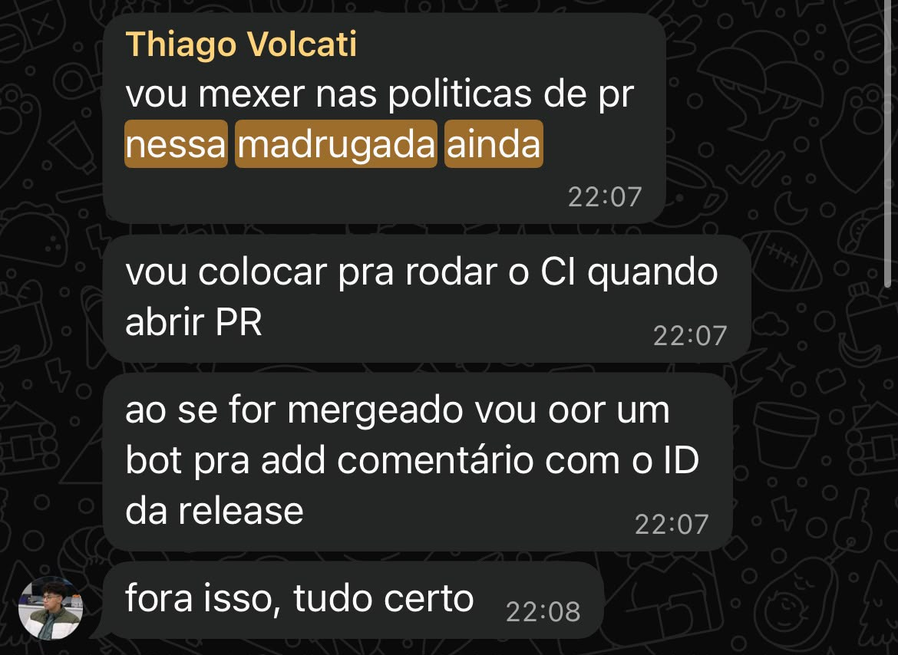
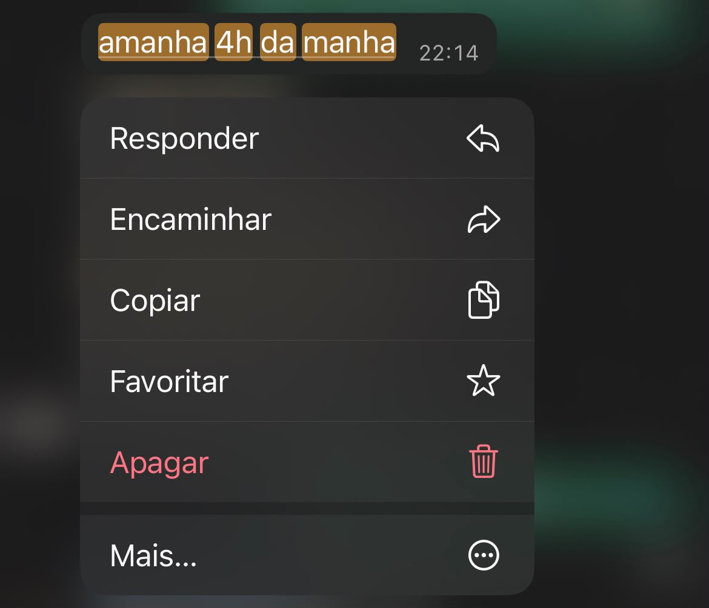
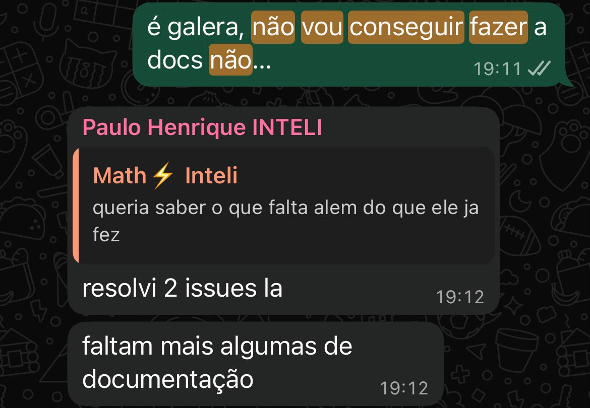

# Auditoria de Realidade DesignOps: O Framework REACH sob a Lente Humana

## Seção 1 — Triangulação de Eficiência & Habilidade

**Ritual auditado.** O gate de revisão de PR, com no mínimo um reviewer obrigatório antes do merge na `develop`. No nosso projeto, esse ritual é DesignOps puro: “DesignOps é o DevOps do Design”, e a revisão é justamente o ciclo de feedback que garante qualidade e consistência na esteira pela qual a interface e a experiência do usuário deveriam fluir sem atrito.

**Onde o processo falhou.** Desde a Sprint 3 desenvolvíamos o dashboard, a interface que entrega a leitura dos dados ao usuário final, e ele dependia da integração com a pipeline e com os módulos Terraform. Quando o PR do Terraform ficou pronto para entrar, porém, a branch `develop` simplesmente não existia: tinha sido destruída no merge anterior, porque o GitLab vinha com a opção “delete source branch on merge” ligada por padrão e ninguém havia configurado a branch protection — algo que se repetiu três vezes até a metade do projeto. Sem a `develop`, não dava para abrir a revisão nem integrar com rapidez. Então, em vez de revisar, integrar e testar, os desenvolvedores gastaram tempo rastreando o que tinha acontecido com a branch e reconstruindo seu estado. Foi por isso que o Terraform só foi revisado na quinta-feira anterior à apresentação da Sprint 3, tarde demais — e o dashboard, que dependia dele, acabou não entrando na Sprint 3 e só estreou na Sprint 4. Para completar, o approval era opcional e a pipeline de CI rodava apenas como informativa: o gate não tinha dente nenhum.

> Fontes: (1) MR da pipeline com Terraform mergeado um dia antes (28/05) da Sprint Review [MR](https://git.inteli.edu.br/graduacao/2026-1b/t13/g01/-/merge_requests/27)
> Fontes: (2) MR do Dashboard. [MR](https://git.inteli.edu.br/graduacao/2026-1b/t13/g01/-/merge_requests/36) Foi mergeado somente 12 horas depois da apresentação e foi efetivamente entregue na Sprint posterior.
> Fontes: (3) Configuração do GitLab (delete source branch when merge): 
> Fontes: (4) Branch develop deletada no meio da sprint: 

**Causa raiz.** Não foi um “processo corporativo irreal” — somos oito engenheiros com dois a três anos de experiência, num módulo que é justamente sobre governança de SDLC. E também não foi falta de conhecimento técnico: a competência (Habilidade) existia. O que caiu foi a aderência ao processo que tínhamos acordado. A Eficiência, que o REACH define como concluir o trabalho sem gargalos nem obstáculos, despencou na prática: o tempo que deveria ter ido para revisar, integrar e testar foi consumido rastreando uma branch perdida, e a entrega de UX atrasou um sprint inteiro.

No fundo, a raiz não é tempo nem capacidade, e sim a falta de um dono. As decisões sobre o processo aconteciam de forma dispersa e tácita, e ninguém assumiu a função de DesignOps. Na linguagem do case TOTVS, todos nós ficamos no papel de “médico de posto de saúde”, apagando incêndio individual, e ninguém parou para “fabricar a vacina” — o processo que elimina o problema na origem. O guardrail que faltava era literal: a branch protection é a “mureta de proteção” de que o REACH fala, mas, como configurá-la era tarefa de todos, acabou não sendo de ninguém. Cachorro da rua morre de fome.

**Como contornamos.** A sangria só parou quando alguém finalmente criou a branch protection, transformando uma regra social num guardrail travado pela ferramenta; e a entrega de design só destravou na Sprint 4, já com o Terraform integrado. A lição é direta: em time assíncrono, acordo verbal não escala — boundary na tooling, sim. E quando o ritual de revisão falha, quem atrasa não é só o código: é a experiência que chega ao usuário.

-----

## Seção 2 — O Desafio da Clareza e dos Resultados

**A decisão.** O dashboard operacional — a interface que entrega ao parceiro as métricas de desenvolvimento (cycle time, throughput, backlog, gargalos). O [DESIGN_OPS.md](./fontes/DESIGN_OPS.md) ancora dois KPIs nela (“Taxa de Erro na Promoção” e “Usabilidade de Gatekeeper <10s”).

**A evidência.** O plano prometia Clareza por dado — regressão visual no BackstopJS (0 diffs), DoD de 5 gates e a Etapa 5 “Monitoramento de Impacto”. Nada disso foi instrumentado (mesma ausência da Seção 3), e, sem baseline, os resultados que levamos à Jacto são deltas **esperados** (Seção 5.2.2 do `Projeto.md`), não medidos. O time reconheceu: em 01/06, *“seria interessante ter mostrado para o cliente pra ver se gostaram”*, com a ressalva “opinião, sem certeza”. 

> 

**A crítica.** Clareza, no REACH, é o parceiro entender o valor; Resultado é o ganho observável. O DesignOps **desenhou** Clareza por evidência, mas **entregou** validação por opinião visual — e falhou em provar o Resultado: sem baseline nem monitoramento rodando, o ganho ficou no projetado, não no comprovado. Causa raiz idêntica à Seção 1: a Etapa 5 nunca teve dono. Bastava medir o tempo de análise de log antes e depois e mostrar à Thamires — um número, não uma tela bonita.

-----

## Seção 3 — A Lente Humana e a Saúde do Time

**O ritual irreal.** O [DESIGN_OPS.md](./fontes/DESIGN_OPS.md) documentou uma operação nível mercado — Design Sync semanal, DoD de 5 gates, Figma → Style Dictionary → Storybook, regressão visual no BackstopJS, SemVer + changelog, revisão **trimestral** de tokens e 4 KPIs. Em uma busca semântica dentro das mensagens do grupo via canais digitais, esses rituais aparecem zero vez (`design sync`, `figma`, `storybook`, `backstop`, `style dictionary`: todos 0). Era plano fantasma: revisão “trimestral” em ~10 semanas já nascia impossível, e os KPIs nunca tiveram baseline. 

**O custo humano.** Saúde, no REACH, é satisfação e sustentabilidade — tivemos o oposto. Espelhar essa operação num time de oito com jornada dupla empurrou trabalho para a madrugada: o conserto das políticas de PR foi “nessa madrugada ainda” (12/03), houve “amanhã 4h da manhã” (01/04) e a capitulação “não vou conseguir fazer a docs não” (12/06). O grupo registrou que *“o estágio compete com o projeto e a energia diminui”*. O overhead não escalou com a capacidade — virou dívida de sono. 
> Fontes: 
> Fontes: 
> Fontes: 

**O que cortar.** Toda a cerimônia de design system (Style Dictionary, Storybook, BackstopJS, SemVer/changelog), a revisão trimestral e os 4 KPIs sem instrumentação. Mantém só o “MR com screenshot” e o contrato de dependência de dados. A régua: ritual que não cabe em 1h/dia e não tem dono não é processo — é texto que gera culpa.

-----

*Responsável por esta seção: Lucas Matheus Nunes*
